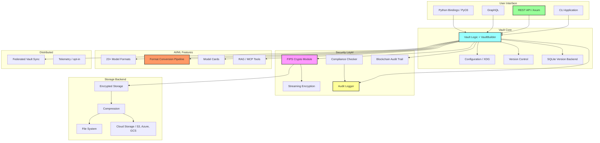
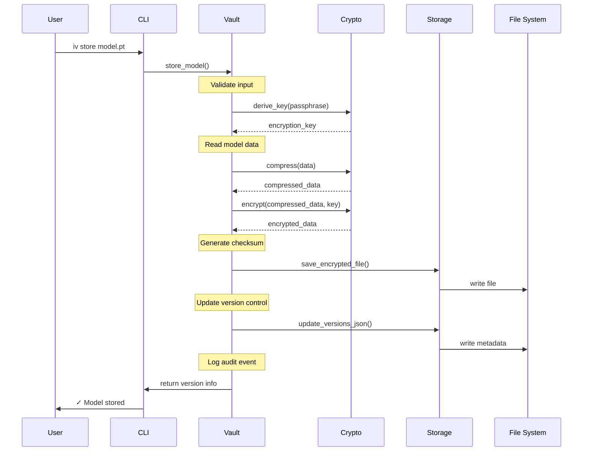
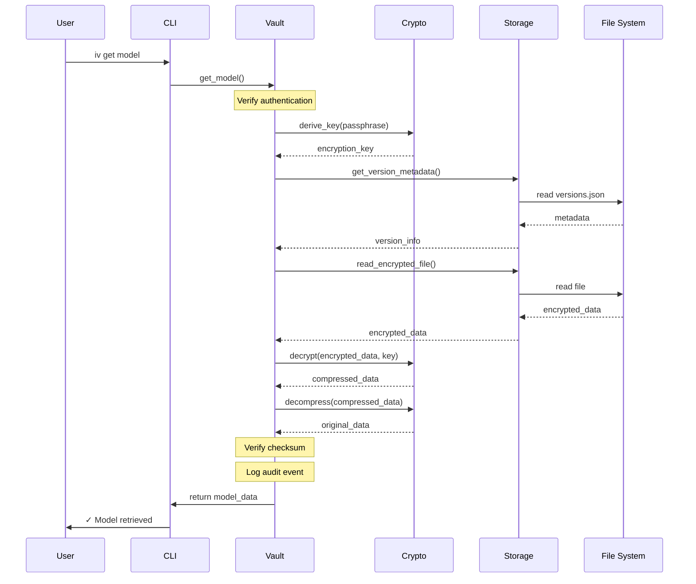
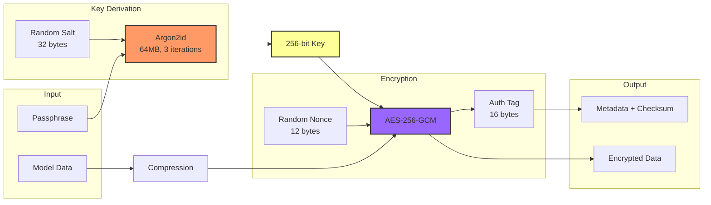
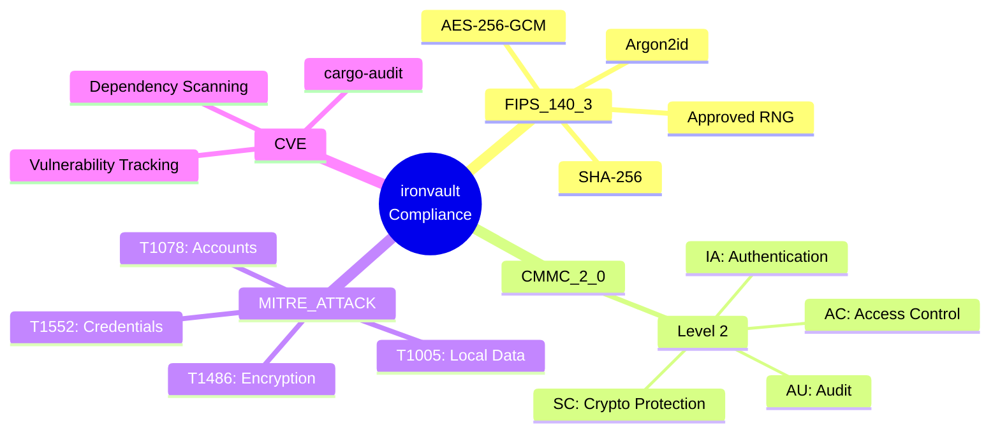
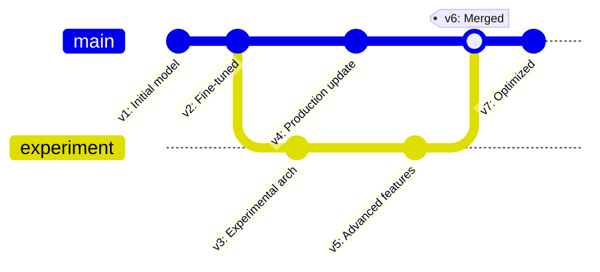
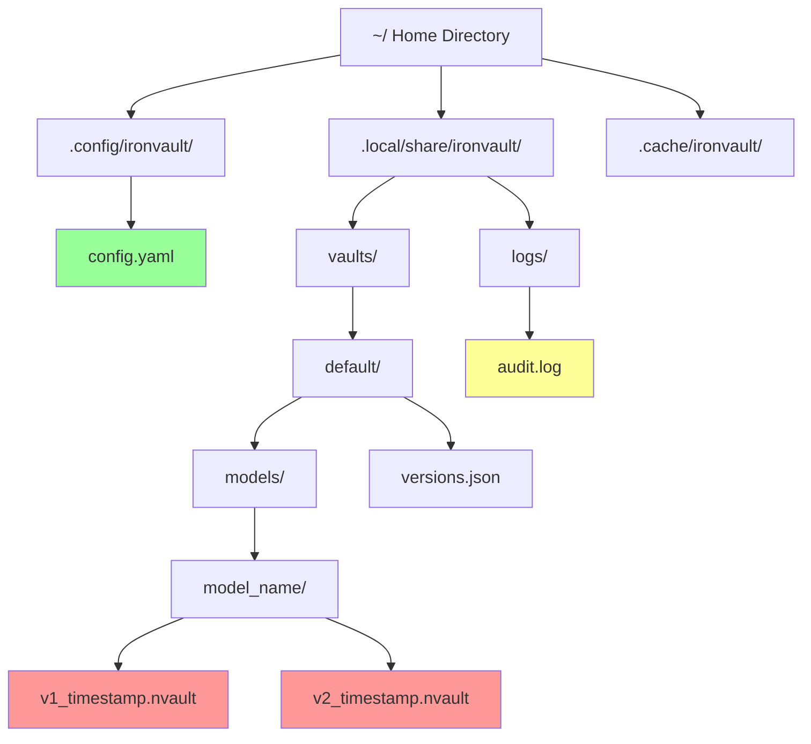
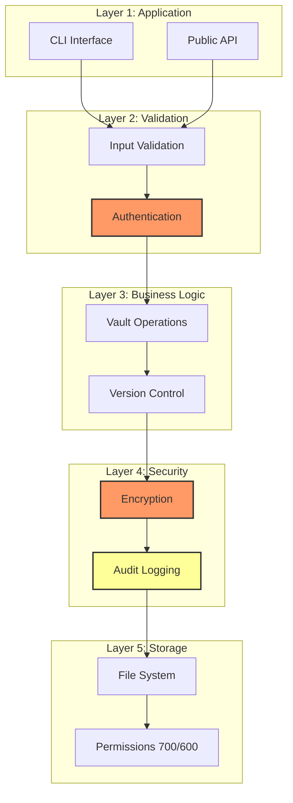
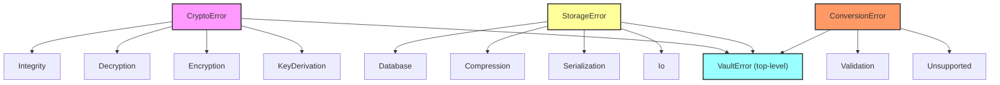
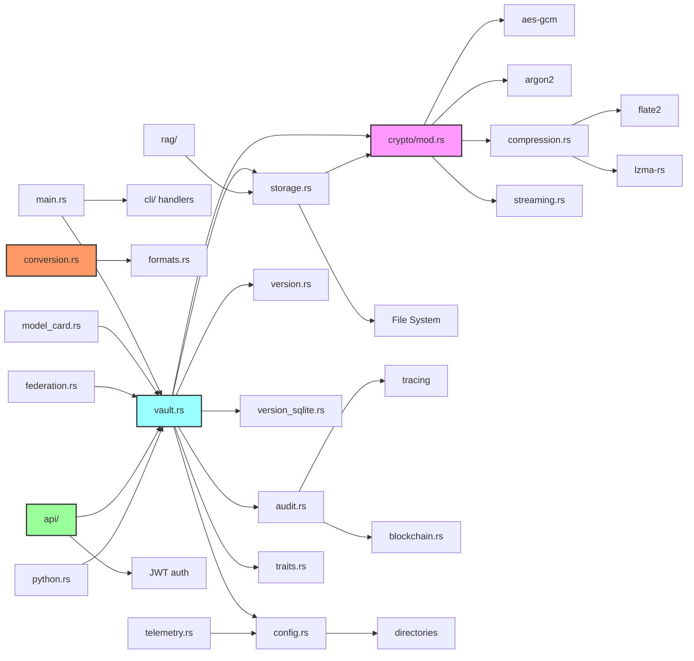

# ironvault Architecture

## System Architecture Diagram

## Data Flow - Store Model

## Data Flow - Retrieve Model

## Cryptographic Architecture

## Compliance Framework

## Version Control Structure

## Directory Structure (XDG Compliant)

## Security Layers

## REST & GraphQL API

The `api` feature provides 20 Axum HTTP endpoints under `/api/v1/` plus a
GraphQL playground (with the `graphql` feature).

### RBAC (Role-Based Access Control)

JWT tokens carry a `role` claim — one of **Admin**, **Operator**, or **Viewer**.
Role enforcement is applied at the route handler level:

| Role         | Capabilities                                                 |
| ------------ | ------------------------------------------------------------ |
| **Admin**    | Full access — all endpoints including audit log and events   |
| **Operator** | Store, retrieve, convert, delete models; view own audit data |
| **Viewer**   | Read-only — list models, stats, compliance, model cards      |

The `/api/v1/audit` and `/api/v1/events` endpoints filter security-sensitive
entries to Admin-only access.

### Endpoint Map

| Method | Path                               | Auth | Description               |
| ------ | ---------------------------------- | ---- | ------------------------- |
| GET    | `/api/v1/health`                   | No   | Health check              |
| POST   | `/api/v1/auth/token`               | No   | Issue JWT token           |
| GET    | `/api/v1/models`                   | Yes  | List all models           |
| GET    | `/api/v1/models/:name`             | Yes  | Get model details         |
| POST   | `/api/v1/models/:name`             | Yes  | Store model               |
| GET    | `/api/v1/models/:name/card`        | Yes  | Get model card            |
| POST   | `/api/v1/models/:name/card`        | Yes  | Create model card         |
| GET    | `/api/v1/models/:name/versions`    | Yes  | List versions             |
| GET    | `/api/v1/models/:name/versions/:v` | Yes  | Get specific version      |
| DELETE | `/api/v1/models/:name/versions/:v` | Yes  | Delete version            |
| GET    | `/api/v1/models/:name/lineage/:v`  | Yes  | Version lineage tree      |
| GET    | `/api/v1/conversions`              | No   | List conversion paths     |
| POST   | `/api/v1/convert`                  | Yes  | Convert model format      |
| GET    | `/api/v1/compliance`               | Yes  | Run compliance checks     |
| POST   | `/api/v1/rag/search`               | Yes  | RAG vector search         |
| POST   | `/api/v1/rag/documents`            | Yes  | Add RAG document          |
| GET    | `/api/v1/stats`                    | Yes  | Vault statistics          |
| GET    | `/api/v1/audit`                    | Yes  | Audit log (Admin-full)    |
| GET    | `/api/v1/metrics`                  | Yes  | Prometheus-style metrics  |
| GET    | `/api/v1/events`                   | Yes  | Event stream (Admin-full) |
| GET    | `/api/v1/openapi.json`             | No   | OpenAPI 3.1 spec          |

### Rate Limiting

The `/api/v1/auth/token` endpoint is protected by a per-IP sliding-window
rate limiter (default: 5 attempts per 60 seconds) to prevent brute-force attacks.

## Error Type Hierarchy

Domain-specific errors carry rich context and convert into the top-level
`VaultError` via `From` impls.

## Module Dependencies

## Test Coverage

| Metric          | Value |
| --------------- | ----- |
| Library tests   | 584   |
| Python tests    | 62    |
| Line coverage   | 86.1% |
| Modules at 100% | 8     |
| Clippy warnings | 0     |

Coverage is measured with `cargo-llvm-cov` using `--features "full,graphql"`.
