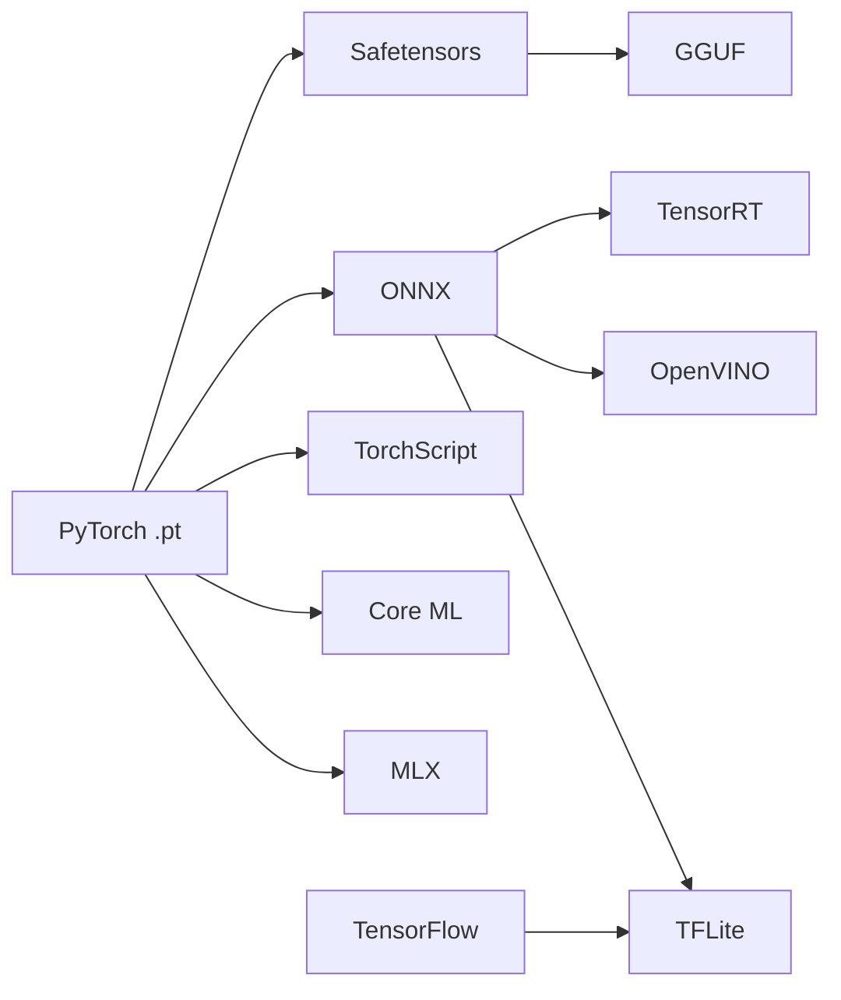

# Model Providers & Formats Guide

## Overview

IronVault (AIMV) supports **23+ model formats** across the entire AI/ML ecosystem, from large language models to computer vision, mobile deployment, and edge computing. This guide provides comprehensive coverage of supported formats, providers, and conversion paths.

## Table of Contents

- [Supported Formats](#supported-formats)
- [Model Providers](#model-providers)
- [Format Conversions](#format-conversions)
- [Deployment Targets](#deployment-targets)
- [Use Cases](#use-cases)
- [Best Practices](#best-practices)
- [Quick Reference](#quick-reference)

---

## Supported Formats

### LLM-Centric Formats

| Format          | Extension             | Description                          | Primary Use                  |
| --------------- | --------------------- | ------------------------------------ | ---------------------------- |
| **Safetensors** | `.safetensors`        | HuggingFace default for Transformers | Safe, fast model loading     |
| **GGUF**        | `.gguf`               | Quantized LLM format                 | CPU inference, low memory    |
| **PyTorch**     | `.pt`, `.pth`, `.bin` | Classic state_dict files             | Training, development        |
| **TensorRT**    | `.plan`               | NVIDIA compiled engines              | Maximum GPU performance      |
| **ONNX**        | `.onnx`               | Interchange/serving format           | Cross-platform compatibility |
| **MLX**         | `.npz`                | Apple Silicon optimized              | M1/M2/M3 native inference    |
| **Core ML**     | `.mlmodel`            | iOS/macOS on-device                  | Apple device deployment      |
| **TorchScript** | `.pt`                 | PyTorch serialization                | Production PyTorch models    |
| **TFLite**      | `.tflite`             | Mobile/edge deployment               | Android, mobile devices      |

### General Deep Learning Formats

| Format         | Extension         | Description               | Primary Use              |
| -------------- | ----------------- | ------------------------- | ------------------------ |
| **TensorFlow** | `.pb`             | TensorFlow SavedModel     | TensorFlow serving       |
| **Keras**      | `.h5`, `.keras`   | Keras model format        | Keras applications       |
| **OpenVINO**   | `.xml` + `.bin`   | Intel optimization format | Intel CPU/GPU/VPU        |
| **TVM**        | `.so`             | Compiled artifacts        | Universal compilation    |
| **NCNN**       | `.param` + `.bin` | Mobile-optimized          | Tencent mobile framework |
| **MNN**        | `.mnn`            | Mobile Neural Network     | Alibaba mobile framework |
| **RKNN**       | `.rknn`           | Rockchip NPU format       | Rockchip devices         |

### Legacy Formats

| Format      | Extension     | Description         | Primary Use            |
| ----------- | ------------- | ------------------- | ---------------------- |
| **Caffe**   | `.caffemodel` | Legacy Caffe format | Legacy computer vision |
| **MXNet**   | `.params`     | Apache MXNet format | MXNet applications     |
| **Darknet** | `.weights`    | YOLO/Darknet format | YOLO object detection  |

### Data Formats

| Format     | Extension      | Description              | Primary Use                   |
| ---------- | -------------- | ------------------------ | ----------------------------- |
| **HDF5**   | `.h5`, `.hdf5` | Hierarchical data format | Large dataset storage         |
| **Pickle** | `.pkl`         | Python pickle format     | Prototyping (not production!) |
| **NumPy**  | `.npy`, `.npz` | NumPy array format       | Array storage                 |

---

## Model Providers

### 🤗 HuggingFace Hub

**Primary Format:** Safetensors (`.safetensors`)  
**Legacy Format:** PyTorch (`.bin`, `.pt`)

**Popular Models:**
- `meta-llama/Llama-2-7b-hf` → Safetensors
- `bert-base-uncased` → Safetensors
- `stable-diffusion-v1-5` → Safetensors
- `mistralai/Mistral-7B-v0.1` → Safetensors

**Benefits:**
- ✅ Fast loading with memory mapping
- ✅ Security (no pickle exploits)
- ✅ Cross-platform compatibility
- ✅ Standard format for open-source models

**AIMV Support:**
```rust
let format = ModelFormat::Safetensors;
let metadata = ModelMetadata::new("llama-2-7b".to_string(), format)
    .with_framework("PyTorch".to_string())
    .with_task("text-generation".to_string());
```

---

### 🦙 Ollama

**Primary Format:** GGUF (`.gguf`)

**Popular Models:**
- `llama2:7b` → GGUF Q4_0 quantization
- `mistral:7b` → GGUF Q4_K_M quantization
- `codellama:13b` → GGUF Q4_K_M quantization
- `phi:2.7b` → GGUF Q4_K_M quantization

**Benefits:**
- ✅ Aggressive quantization (4-bit, 5-bit)
- ✅ CPU-optimized inference
- ✅ Low memory footprint
- ✅ Easy local deployment

**AIMV Support:**
```rust
let format = ModelFormat::GGUF;
let metadata = ModelMetadata::new("mistral-7b-q4".to_string(), format)
    .with_framework("llama.cpp".to_string())
    .add_custom_field("quantization".to_string(), "Q4_K_M".to_string());
```

---

### 🎙️ LM Studio

**Primary Format:** GGUF (`.gguf`)

**Popular Models:**
- `TheBloke/Llama-2-7B-GGUF` → Multiple quantizations
- `TheBloke/Mistral-7B-GGUF` → Q4_K_M, Q5_K_M, Q8_0
- `TheBloke/CodeLlama-13B-GGUF` → Various quants

**Quantization Options:**
- `Q4_K_M` - 4.5 bits per weight, best quality-size balance
- `Q5_K_M` - 5.5 bits per weight, higher quality
- `Q8_0` - 8 bits per weight, near original quality

**Benefits:**
- ✅ Desktop GUI interface
- ✅ Multiple quantization levels
- ✅ Local model management
- ✅ Compatible with Ollama models

---

### 🚀 llama.cpp

**Primary Format:** GGUF (`.gguf`)  
**Legacy Format:** GGML (`.bin`) - deprecated

**Quantization Types:**
```
Q4_0    - 4-bit, fast, lower quality
Q4_K_M  - 4-bit with k-quants (mixed precision)
Q5_K_M  - 5-bit with k-quants
Q8_0    - 8-bit, high quality
F16     - 16-bit float (original quality)
```

**Benefits:**
- ✅ C++ native implementation
- ✅ Fast CPU inference
- ✅ Metal acceleration (macOS)
- ✅ CUDA support (NVIDIA)
- ✅ Extensive quantization options

**AIMV Integration:**
```rust
// Store GGUF models with quantization metadata
let metadata = ModelMetadata::new("model".to_string(), ModelFormat::GGUF)
    .add_custom_field("quantization".to_string(), "Q4_K_M".to_string())
    .add_custom_field("bits_per_weight".to_string(), "4.5".to_string())
    .add_custom_field("perplexity".to_string(), "5.82".to_string());
```

---

### 🖼️ Stable Diffusion / ComfyUI

**Primary Format:** Safetensors (`.safetensors`)  
**Legacy Format:** PyTorch (`.ckpt`, `.pt`)

**Popular Models:**
- `sd-v1-5.safetensors` → Stable Diffusion 1.5
- `sd-xl-base.safetensors` → SDXL base model
- `controlnet.safetensors` → ControlNet weights
- `lora-weights.safetensors` → LoRA fine-tuning

**Benefits:**
- ✅ Safe loading (no code execution)
- ✅ Fast loading and validation
- ✅ Widely supported by SD tools
- ✅ Smaller file sizes than `.ckpt`

---

### ⚡ NVIDIA TensorRT

**Primary Format:** TensorRT Engine (`.plan`)

**Use Cases:**
- LLM inference with TensorRT-LLM
- Computer vision inference
- Maximum GPU throughput
- Production deployments

**Benefits:**
- ✅ Maximum NVIDIA GPU performance
- ✅ Optimized kernels and fusion
- ✅ FP16/INT8 quantization
- ✅ Batch optimization

**AIMV Support:**
```rust
let format = ModelFormat::TensorRT;
let metadata = ModelMetadata::new("llm-engine".to_string(), format)
    .add_custom_field("precision".to_string(), "FP16".to_string())
    .add_custom_field("max_batch_size".to_string(), "8".to_string());
```

---

### 🍎 Apple MLX

**Primary Format:** MLX (`.npz`)

**Popular Models:**
- `llama-7b-mlx.npz` → Llama 2 for Apple Silicon
- `mistral-7b-mlx.npz` → Mistral for M1/M2/M3
- `phi-2-mlx.npz` → Phi-2 optimized

**Benefits:**
- ✅ Native Apple Silicon optimization
- ✅ Unified memory architecture
- ✅ GPU acceleration on M-series chips
- ✅ NumPy-like API

**Conversion:**
```bash
# Convert PyTorch to MLX
python -m mlx.convert model.pt --output model.npz
```

---

### 📱 Mobile Deployment

#### iOS/macOS - Core ML

**Format:** `.mlmodel`, `.mlmodelc` (compiled)

**Examples:**
- `yolov5-coreml.mlmodel` → iOS object detection
- `bert-coreml.mlmodel` → On-device NLP
- `stable-diffusion.mlmodelc` → Image generation

**Benefits:**
- ✅ Optimized for Apple Neural Engine
- ✅ Battery-efficient
- ✅ Privacy-preserving (on-device)
- ✅ iOS/macOS native integration

#### Android - TensorFlow Lite

**Format:** `.tflite`

**Examples:**
- `mobilenet-v3.tflite` → Image classification
- `efficientdet.tflite` → Object detection
- `bert-base.tflite` → Text processing

**Benefits:**
- ✅ Optimized for mobile CPUs/GPUs
- ✅ Small model size
- ✅ Fast inference
- ✅ Android neural networks API (NNAPI)

#### Cross-Platform - ONNX Runtime

**Format:** `.onnx`

**Benefits:**
- ✅ Runs on iOS, Android, Web
- ✅ Hardware acceleration support
- ✅ Single model for all platforms

---

### 🔧 Edge & Embedded

#### Intel OpenVINO

**Format:** `.xml` + `.bin` (IR format)

**Supported Hardware:**
- Intel CPUs (x86, Xeon)
- Intel integrated GPUs
- Intel VPUs (Movidius)
- Intel Neural Compute Stick 2

**Benefits:**
- ✅ Optimized for Intel hardware
- ✅ CPU inference acceleration
- ✅ Model optimization toolkit
- ✅ Extensive pre-optimized models

#### Tencent NCNN

**Format:** `.param` + `.bin`

**Supported Platforms:**
- ARM CPUs (mobile, embedded)
- Vulkan GPU acceleration
- iOS, Android, Linux

**Benefits:**
- ✅ Mobile-optimized
- ✅ Minimal dependencies
- ✅ Fast inference on ARM
- ✅ Vulkan compute support

#### Rockchip RKNN

**Format:** `.rknn`

**Supported Hardware:**
- RK3588 NPU
- RK3568 NPU
- Other Rockchip SoCs

**Benefits:**
- ✅ NPU hardware acceleration
- ✅ Low power consumption
- ✅ Edge AI applications

---

## Format Conversions

### Common Conversion Paths



### Conversion Tools & Commands

#### PyTorch → Safetensors

```python
from safetensors.torch import save_file
import torch

# Load PyTorch model
state_dict = torch.load("model.pt")

# Save as Safetensors
save_file(state_dict, "model.safetensors")
```

#### Safetensors → GGUF (Quantization)

```bash
# Using llama.cpp conversion tools
python convert.py model.safetensors --outtype q4_k_m --outfile model-q4.gguf
```

#### PyTorch → ONNX

```python
import torch
import torch.onnx

# Export to ONNX
torch.onnx.export(
    model,
    dummy_input,
    "model.onnx",
    input_names=['input'],
    output_names=['output'],
    dynamic_axes={'input': {0: 'batch'}, 'output': {0: 'batch'}}
)
```

#### ONNX → TensorRT

```bash
# Using trtexec
trtexec --onnx=model.onnx --saveEngine=model.plan --fp16
```

#### PyTorch → Core ML

```python
import coremltools as ct

# Convert PyTorch to Core ML
traced_model = torch.jit.trace(model, example_input)
mlmodel = ct.convert(traced_model, inputs=[ct.TensorType(shape=input_shape)])
mlmodel.save("model.mlmodel")
```

#### PyTorch → TFLite

```python
import ai_edge_torch

# Convert PyTorch to TFLite
edge_model = ai_edge_torch.convert(model, (sample_input,))
edge_model.export("model.tflite")
```

### Conversion Workflows

#### Training → Production LLM Serving

**Option 1: NVIDIA GPU**
```
PyTorch (.pt) → Safetensors → TensorRT Engine → vLLM
```

**Option 2: CPU Inference**
```
PyTorch (.pt) → Safetensors → GGUF (Q4_K_M) → Ollama
```

#### Research Model → Mobile App

```
HuggingFace (Safetensors) → ONNX → TFLite/Core ML
+ Quantization (INT8) + Pruning
```

#### Image Model → Edge Device

```
PyTorch (.pt) → ONNX → OpenVINO IR → Intel NUC/NCS2
```

#### LLM → Apple Silicon

```
HuggingFace → PyTorch → MLX → M1/M2/M3 Mac
```

---

## Deployment Targets

### 🖥️ Desktop/Server (NVIDIA GPU)

**Recommended Formats:**
1. **TensorRT Engine** (`.plan`) - Best performance
2. **GGUF** (`.gguf`) - CPU fallback with quantization
3. **Safetensors** (`.safetensors`) - Original weights
4. **ONNX** (`.onnx`) - Cross-platform compatibility

**Use Case:** Production LLM serving, high-throughput inference

---

### 🍎 Apple Silicon (M1/M2/M3)

**Recommended Formats:**
1. **MLX** (`.npz`) - Native Apple Silicon optimization
2. **Core ML** (`.mlmodel`) - On-device inference
3. **GGUF** (`.gguf`) - llama.cpp with Metal acceleration
4. **ONNX** (`.onnx`) - ONNX Runtime CoreML

**Use Case:** Local LLM inference, on-device AI

---

### 📱 Mobile (iOS)

**Recommended Formats:**
1. **Core ML** (`.mlmodel`) - Primary choice
2. **TensorFlow Lite** (`.tflite`) - TFLite on iOS
3. **ONNX Mobile** (`.onnx`) - ONNX Runtime Mobile

**Use Case:** On-device inference, privacy-preserving AI

---

### 📱 Mobile (Android)

**Recommended Formats:**
1. **TensorFlow Lite** (`.tflite`) - Primary choice
2. **NNAPI** (`.onnx`) - Android Neural Networks API
3. **NCNN** (`.param`) - Tencent mobile framework
4. **MNN** (`.mnn`) - Alibaba mobile framework

**Use Case:** Android apps, edge AI

---

### 🎮 Edge Devices

**Recommended Formats:**
1. **OpenVINO** (`.xml`) - Intel CPU/GPU/VPU/NCS2
2. **TensorRT** (`.plan`) - NVIDIA Jetson
3. **RKNN** (`.rknn`) - Rockchip NPU (RK3588)
4. **NCNN** (`.param`) - ARM mobile processors

**Use Case:** IoT devices, embedded systems, edge computing

---

### ☁️ Cloud Inference

**Recommended Formats:**
1. **ONNX** (`.onnx`) - Triton Inference Server
2. **TensorRT** (`.plan`) - NVIDIA Triton
3. **Safetensors** (`.safetensors`) - HuggingFace TGI
4. **TorchScript** (`.pt`) - TorchServe

**Use Case:** Scalable cloud inference, multi-model serving

---

### 🧪 Research/Development

**Recommended Formats:**
1. **PyTorch** (`.pt`) - Training and experimentation
2. **Safetensors** (`.safetensors`) - Model sharing
3. **ONNX** (`.onnx`) - Format evaluation
4. **Pickle** (`.pkl`) - Prototyping only (security risk!)

**Use Case:** Research, experimentation, model development

---

## Use Cases

### LLM Inference

#### Local CPU (Low Memory)
- **Format:** GGUF with Q4_K_M quantization
- **Tools:** Ollama, LM Studio, llama.cpp
- **Memory:** ~4-5 GB for 7B model
- **Speed:** 10-30 tokens/sec (CPU dependent)

#### Local CPU (High Quality)
- **Format:** GGUF with Q8_0 quantization or Safetensors
- **Tools:** llama.cpp, HuggingFace Transformers
- **Memory:** ~8-10 GB for 7B model
- **Speed:** 5-15 tokens/sec

#### GPU Inference (NVIDIA)
- **Format:** TensorRT Engine (best) or Safetensors
- **Tools:** vLLM, TGI, TensorRT-LLM
- **Memory:** 16+ GB VRAM recommended
- **Speed:** 100+ tokens/sec

#### GPU Inference (Apple Silicon)
- **Format:** MLX or GGUF with Metal
- **Tools:** MLX, llama.cpp
- **Memory:** Unified memory (16+ GB recommended)
- **Speed:** 30-60 tokens/sec on M2 Max

---

### Computer Vision

#### Server Inference
- **Format:** TensorRT Engine (NVIDIA) or ONNX Runtime
- **Tools:** Triton, ONNX Runtime
- **Throughput:** 100+ FPS on V100

#### Mobile Deployment
- **Format:** Core ML (iOS) or TFLite (Android)
- **Tools:** Xcode, Android Studio
- **Throughput:** 30+ FPS on device

#### Edge Devices
- **Format:** OpenVINO (Intel) or NCNN/MNN (ARM)
- **Tools:** OpenVINO Toolkit, ncnn
- **Throughput:** 10-30 FPS

---

### Speech/Audio

#### Real-time Processing
- **Format:** ONNX Runtime (low latency) or TensorRT
- **Latency:** <100ms end-to-end
- **Use Case:** Voice assistants, transcription

#### Mobile Apps
- **Format:** Core ML (iOS) or TFLite (Android)
- **Use Case:** On-device speech recognition

---

### Model Distribution

#### Open Source Sharing
- **Format:** Safetensors (standard) + GGUF (quantized variants)
- **Platform:** HuggingFace Hub
- **Benefits:** Wide compatibility, security

#### Production Deployment
- **Format:** TensorRT Engine (compiled) or ONNX
- **Benefits:** Optimized performance, cross-framework

---

## Best Practices

### Format Selection

1. **Use Safetensors as interchange format**
   - Safe (no pickle exploits)
   - Fast loading
   - Memory mapping support
   - Industry standard

2. **Keep original weights in version control**
   - Store PyTorch or Safetensors originals
   - Generate optimized formats on deployment
   - Enables re-quantization/re-optimization

3. **Test converted models for accuracy**
   - Measure perplexity (LLMs) or accuracy (vision)
   - Compare against baseline
   - Document quality metrics

4. **Document quantization settings**
   - Record quantization method (Q4_K_M, INT8, etc.)
   - Store perplexity/accuracy metrics
   - Note inference performance

5. **Benchmark inference speed**
   - Test on target hardware
   - Measure tokens/sec (LLMs) or FPS (vision)
   - Profile memory usage

6. **Store metadata with models**
   ```rust
   let metadata = ModelMetadata::new(name, format)
       .with_framework("PyTorch".to_string())
       .with_task("text-generation".to_string())
       .add_custom_field("quantization".to_string(), "Q4_K_M".to_string())
       .add_custom_field("perplexity".to_string(), "5.82".to_string());
   ```

### Conversion Best Practices

1. **Validate after conversion**
   - Run inference tests
   - Compare outputs with original
   - Check for numerical stability

2. **Use appropriate quantization**
   - Q4_K_M: Good balance (4.5 bpw)
   - Q5_K_M: Higher quality (5.5 bpw)
   - Q8_0: Near-original quality (8 bpw)
   - INT8: Good for vision models

3. **Optimize for target hardware**
   - TensorRT for NVIDIA GPUs
   - MLX for Apple Silicon
   - OpenVINO for Intel CPUs
   - TFLite for mobile devices

4. **Document conversion process**
   - Record tools and versions used
   - Note any custom configurations
   - Store conversion scripts

### Storage Recommendations

1. **Original Models**
   - Store in `~/.local/share/ai/models/vaults/`
   - Use Safetensors when possible
   - Encrypt with AIMV encryption

2. **Converted Models**
   - Store in same vault with different format
   - Link to original via metadata
   - Document conversion parameters

3. **Quantized Variants**
   - Store multiple quantization levels
   - Name clearly: `model-q4.gguf`, `model-q8.gguf`
   - Include quality metrics in metadata

---

## Quick Reference

### Format Priority by Use Case

```
Production LLM Serving:  TensorRT > GGUF Q4_K_M > Safetensors > ONNX
Model Development:       PyTorch > Safetensors > ONNX > TorchScript
Mobile Deployment:       Core ML > TFLite > ONNX Mobile > NCNN
Edge Devices:            OpenVINO > TensorRT > NCNN > RKNN
Cross-Platform:          ONNX > Safetensors > GGUF > TFLite
Apple Ecosystem:         MLX > Core ML > GGUF+Metal > ONNX
```

### Extension → Format Mapping

```rust
.safetensors  → ModelFormat::Safetensors
.gguf         → ModelFormat::GGUF
.pt, .pth     → ModelFormat::PyTorch
.onnx         → ModelFormat::ONNX
.plan         → ModelFormat::TensorRT
.mlmodel      → ModelFormat::CoreML
.tflite       → ModelFormat::TFLite
.npz (MLX)    → ModelFormat::MLX
.xml          → ModelFormat::OpenVINO
```

### Common Commands

```bash
# Format detection
cargo run --example providers_formats_demo

# Store model with metadata
iv store model.safetensors --name "llama-2-7b" --format safetensors

# Convert format (when implemented)
iv convert model.safetensors --to gguf --quant q4_k_m

# List formats
iv formats list
```

---

## AIMV Code Examples

### Detecting Model Format

```rust
use ironvault::formats::ModelFormat;

let format = ModelFormat::from_extension("safetensors");
println!("Format: {}", format.name()); // "Safetensors"
```

### Creating Model Metadata

```rust
use ironvault::formats::{ModelFormat, ModelMetadata};

let metadata = ModelMetadata::new(
    "llama-2-7b-chat".to_string(),
    ModelFormat::Safetensors,
)
.with_description("Llama 2 7B Chat".to_string())
.with_framework("PyTorch".to_string())
.with_task("text-generation".to_string())
.with_architecture("LlamaForCausalLM".to_string())
.with_parameters(7_000_000_000)
.add_custom_field("license".to_string(), "Llama 2".to_string())
.add_custom_field("context_length".to_string(), "4096".to_string());
```

### Format Converter Registry

```rust
use ironvault::formats::FormatConverter;

let mut converter = FormatConverter::new();

// Register converter
converter.register(
    ModelFormat::PyTorch,
    ModelFormat::Safetensors,
    |data| {
        // Conversion logic here
        Ok(converted_data)
    }
);

// Check if conversion supported
if converter.can_convert(from_format, to_format) {
    let converted = converter.convert(&data, from_format, to_format)?;
}
```

---

## Additional Resources

### Official Documentation

- [HuggingFace Safetensors](https://huggingface.co/docs/safetensors)
- [llama.cpp GGUF](https://github.com/ggerganov/llama.cpp)
- [ONNX Runtime](https://onnxruntime.ai/)
- [TensorRT](https://developer.nvidia.com/tensorrt)
- [Core ML](https://developer.apple.com/documentation/coreml)
- [TensorFlow Lite](https://www.tensorflow.org/lite)
- [OpenVINO](https://docs.openvino.ai/)

### Conversion Tools

- [llama.cpp convert.py](https://github.com/ggerganov/llama.cpp/blob/master/convert.py)
- [optimum-cli](https://huggingface.co/docs/optimum/main/en/exporters/onnx/usage_guides/export_a_model)
- [TensorRT-LLM](https://github.com/NVIDIA/TensorRT-LLM)
- [coremltools](https://github.com/apple/coremltools)
- [ai_edge_torch](https://github.com/google-ai-edge/ai-edge-torch)

### Model Repositories

- [HuggingFace Hub](https://huggingface.co/models)
- [ONNX Model Zoo](https://github.com/onnx/models)
- [TensorFlow Hub](https://www.tensorflow.org/hub)
- [PyTorch Hub](https://pytorch.org/hub/)

---

**IronVault (AIMV)** - Universal model storage with support for 23+ formats across the entire AI/ML ecosystem.
